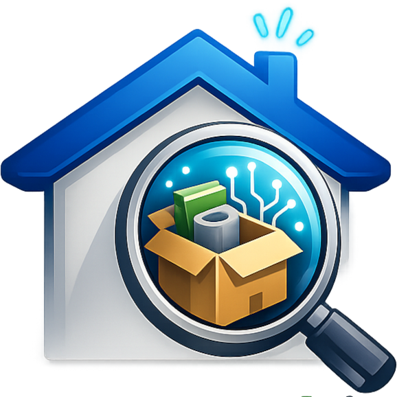

<p align="center">
  
</p>

<h1 align="center">Where I Put It</h1>

<p align="center">
  <strong>A self-hostable catalog for your physical things — and instant search to find where each one lives.</strong>
</p>

<p align="center">
  Cables, tools, batteries, devices, boxes in the attic — record <em>what</em> you own,
  <em>which category</em> it belongs to, and <em>where</em> it physically lives, then find it
  in a keystroke instead of hunting through every drawer.
</p>

<p align="center">
  <a href="https://whereiput.it">whereiput.it</a> &middot;
  <a href="#-quick-start-self-host">Self-host</a> &middot;
  <a href="#-repositories">Repositories</a> &middot;
  <a href="#-license">License</a>
</p>

<p align="center">
  
  
  
  
</p>

---

## What is this?

**Where I Put It** is a personal and household inventory system. You catalog your physical
belongings — organised into **Areas** (a room, a garage, an office) and **Locations** inside
them (a shelf, a drawer, a labelled box) — and then **search by name** to instantly see where
something is, across every Area you have access to.

> **Core promise:** type the name of a thing and immediately see where it is. If everything
> else fails, search-to-location must just work.

It's built to be **multi-user and permission-scoped** (you only ever see Areas shared with
you), **AI-assisted** (snap a photo and let it draft the item), and **self-hostable** with a
single Docker command. The hosted version lives at **[whereiput.it](https://whereiput.it)**.

## ✨ Features

- 🔎 **Search-to-location** — fast, typo-tolerant full-text search (Typesense via Laravel
  Scout) that always resolves to *where the item physically is*.
- 🗂️ **Areas → Locations → Items** — a simple, intuitive hierarchy with categories and tags.
- 🔐 **Permission-scoped per Area** — share an Area with others; access is enforced
  server-side, including inside search results. A user never sees another Area's items.
- 📷 **AI photo recognition** — photograph an item and have the details drafted for you
  (bring-your-own-key; per-user or organisation-wide credentials).
- 🤖 **MCP server** — query and manage your inventory from AI assistants (Claude, etc.)
  through a scoped personal API token.
- 🏠 **Home Assistant voice search** — "where did I put the …?" answered out loud.
- 📱 **Vue / Nuxt SPA** — a fast, mobile-friendly front end.
- 🐳 **Self-hostable** — `docker compose up` with a lightweight SQLite profile or a full
  Postgres + Typesense stack.

## 🧱 Architecture

| Layer        | Technology |
|--------------|-----------|
| Backend / API | [WinterCMS](https://wintercms.com) ~1.2 (Laravel 9.x), PHP 8.4+ |
| Inventory logic | `Golem15.Inventory` plugin (REST API, permissions, search indexing, AI) |
| Search        | [Typesense](https://typesense.org) via [Laravel Scout](https://laravel.com/docs/scout) |
| Front end     | Vue 3 / Nuxt SPA |
| Auth          | JWT for the SPA; scoped personal API tokens for the MCP/integrations |
| AI            | Pluggable engines via the Golem AI plugin (BYOK) |

The REST API is served under `/_inventory/api/v1` (JWT/cookie, used by the SPA) and
`/api/v1/inventory` (personal-token-scoped, used by the MCP server and integrations).

## 📦 Repositories

This is the umbrella application (WinterCMS backend + Golem15 plugin stack). The product is
split across a few open-source repositories:

| Repository | What it is |
|------------|-----------|
| **this repo** | The full self-host application: WinterCMS backend, Docker setup, and the Golem15 plugin stack as submodules |
| [`wn-inventory-plugin`](https://github.com/golem15com/wn-inventory-plugin) | The `Golem15.Inventory` WinterCMS plugin — data model, REST API, permissions, search, AI |
| `vue-inventory-app` | The Vue / Nuxt single-page front end |
| `inventory-mcp` | Model Context Protocol server for AI assistants |
| `ha-inventory-addon` | Home Assistant add-on for voice search |

> Some component repositories are being opened up alongside this one — links will go live as
> each is published under the [golem15com](https://github.com/golem15com) organisation.

## 🚀 Quick start (self-host)

**Requirements:** Docker + Docker Compose.

```bash
git clone --recurse-submodules https://github.com/golem15com/wn-inventory-app.git inventory
cd inventory
cp .env.docker.example .env.docker
# Edit .env.docker: set ADMIN_EMAIL and a STRONG ADMIN_PASSWORD.
# Leave APP_KEY / JWT_SECRET blank — they are generated once and persisted on first boot.

# Lightweight: SQLite + scoped DB search (no external services)
docker compose --profile light up

# Or full stack: Postgres + Typesense + queue worker (set TYPESENSE_API_KEY first)
docker compose --profile full up
```

Then open **http://localhost:8088** and sign in with the admin you configured.

- **light** profile — SQLite, smallest footprint, great for a home server / Raspberry Pi.
- **full** profile — Postgres + Typesense + a background queue worker for production-grade
  search and throughput.

`APP_KEY` and `JWT_SECRET` are generated **once** and persisted to the data volume — never
rotate them in place, or you'll orphan encrypted API keys and break auth. See the comments in
[`.env.docker.example`](.env.docker.example).

## 🛠️ Local development (without Docker)

```bash
git clone --recurse-submodules <repo-url> inventory
cd inventory

# Backend (WinterCMS) — non-interactive, defaults to SQLite
./backend-init.sh

# Front end (Vue/Nuxt)
./scripts/frontend-init.sh

# Optional: local Typesense for full-text search
./run-typesense.sh
```

Useful commands:

```bash
php artisan winter:up              # run migrations
php artisan inventory:reindex      # (re)build the search index
php artisan cache:clear
./vendor/bin/phpunit -c plugins/golem15/inventory/phpunit.xml   # plugin test suite
```

Plugins are managed as git submodules — see `git submodule update --remote --merge` and
`scripts/update-submodules.sh`.

## 🤝 Contributing

Issues and pull requests are welcome. For anything substantial, please open an issue first to
discuss the approach. By contributing, you agree that your contributions are licensed under the
project's MIT license.

## 📄 License

Released under the **[MIT License](LICENSE.md)** — free to use, modify, self-host, and build
on, including commercially.

Bundled WinterCMS core, Laravel, and other dependencies remain under their own licenses (all
MIT-compatible); see [`LICENSE.md`](LICENSE.md) and [`LICENSE`](LICENSE) for details.

---

<p align="center">
  Built with ❤️ by <a href="https://golem15.com">Golem15</a> · Hosted at <a href="https://whereiput.it">whereiput.it</a>
</p>
